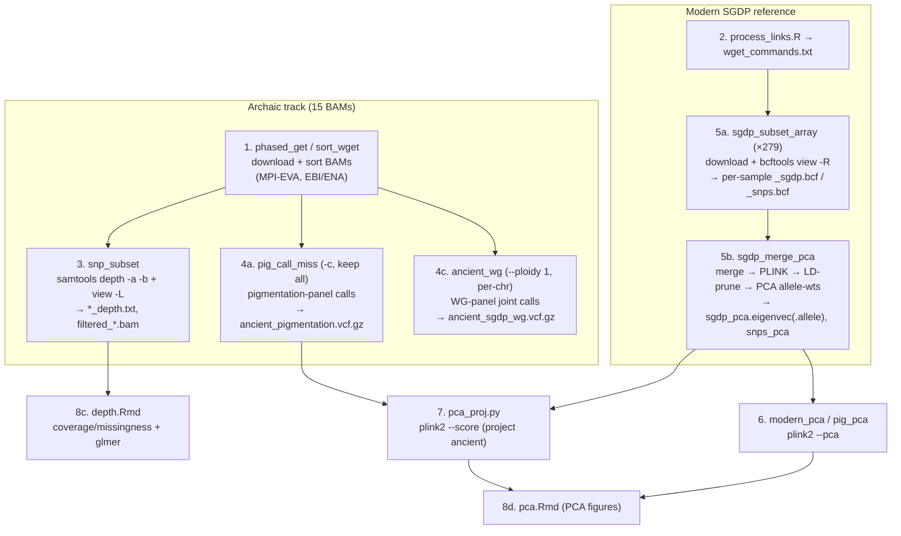

# PAINT — bioinformatics pipeline workbook

A step-by-step, audit-oriented record of the PAINT pipeline: every step, its inputs and outputs (path · format · upstream source), the exact command + tool, key parameters, and what a reviewing bioinformatician should double-check. **The goal is auditability** — the "⚠ Verify" notes are the reviewer's worklist, and it is fine to change results as long as each step is done well.

- **Snapshot:** 2026-07-23. Scripts read verbatim from the cluster (`/nfs/turbo/lsa-tlasisi1/lheald_thesis/aDNA_data`) and the repo (`analysis/`).
- **Repo-only:** this file is not published to the website (it lists internal cluster paths).
- **Related:** [`cluster_inventory.md`](cluster_inventory.md) (what's on disk), [`plan.md`](plan.md) (roadmap), [`verify/BUG_EVIDENCE.md`](verify/BUG_EVIDENCE.md) (bug evidence).

> **Two-pipeline warning.** Several stages have **two competing implementations** (an early/buggy one and a corrected twin, or an "Approach A" per-sample path and an "Approach B" merge-first path). They write overlapping filenames, so *the last one run wins*. Wherever this happens it's flagged, and §"Which scripts are canonical" summarizes the best current guess — **but the reviewer must confirm from file timestamps / SLURM logs which script actually produced the thesis results.**

---

## Environment & traceability

| Item | What the scripts use | Traceability |
|---|---|---|
| Reference genome | `reference/hs37d5.fa` = **GRCh37 / hg19** (numeric contigs, `1`,`2`,…). `pca_ancient.slurm` alone references `hg19.fa` (chr-prefixed) — **absent**. | ⚠ The SNP panel is on **hg38** (see the build-mismatch issue) — panel and data are on *different builds*. |
| samtools | `module load Bioinformatics samtools/1.21` (pinned in most scripts) | ✅ pinned |
| bcftools | `module load Bioinformatics bcftools` (**no version**) | ⚠ version unrecorded |
| PLINK | mostly `module load Bioinformatics plink` (unversioned) but the `plink2` binary is invoked; `sgdp_merge_pca.slurm` pins `plink/2.0`; `pca_ancient.slurm` uses PLINK **1.9** (`plink`, different PCA algorithm) | ⚠ mixed / mostly unpinned |
| Python | `pca_proj.py`, `pig_pca_proj.py`: stdlib only, call bare `plink2` on PATH | ⚠ no version capture |
| R | pages load ggplot2, tidyverse, data.table, sf, raster, rnaturalearth(data), ggspatial, viridis, ggrepel, reshape2, showtext, sysfonts, wesanderson, lme4, patchwork, readr, knitr, workflowr | ⚠ no `renv`/lockfile; `font_add_google` + one live URL need network |
| Cluster | UMich Great Lakes, SLURM account `tlasisi0`, scratch `/scratch/tlasisi_root/tlasisi0/lheald` | — |

**First thing a reviewer should do:** capture versions on the cluster — `bcftools --version`, `plink2 --version`, `samtools --version` — and record the panel/BED provenance (see the depth step: the panel BED lives in a personal home dir).

---

## Data-flow overview



---

# Stage A — Archaic sample track

## A1. Download & sort archaic BAMs — `phased_get.slurm`, `sort_wget.slurm`
**Purpose:** fetch the archaic Neanderthal/Denisovan alignments and produce coordinate-sorted, indexed BAMs.

- **`phased_get.slurm`** — Vindija 33.19 only. Downloads 24 per-chromosome BAMs from MPI-EVA (Prüfer et al. 2017), merges, sorts, indexes.
  ```bash
  BASE_URL="http://ftp.eva.mpg.de/neandertal/Vindija/bam/Pruefer_etal_2017/Vindija33.19/"
  for chr in {1..22} X Y; do wget -nc "${BASE_URL}/Vi33.19.chr${chr}.indel_realn.bam"; done
  for bam in Vi33.19.chr*.indel_realn.bam; do samtools quickcheck -v "$bam"; samtools index "$bam"; done
  samtools merge -o vindija33.bam Vi33.19.chr*.indel_realn.bam
  samtools sort -o vindija33_sorted.bam vindija33.bam && samtools index vindija33_sorted.bam
  ```
- **`sort_wget.slurm`** — 5 samples via hardcoded URL→name list: `den11` (ERR2273828), `scladina` (ERR9741105), `hst` (MPI-EVA L5386), `mez1` (ERR257722), `spy` (MPI-EVA A9416). For each: `wget -O`, `samtools index` (raw), `samtools sort`, `samtools index`.
- **Outputs:** `results/sorted/<sample>_sorted.bam` (+ `.bai`); Vindija at repo-root `vindija33_sorted.bam`.
- **Tools:** `samtools/1.21`, `wget`.

**⚠ Verify:**
- **Sample identities are inferred from filenames/accessions**, not labels in the script — confirm each ENA accession / MPI-EVA path is the intended individual (esp. `den11` = Denisova 11, a Neanderthal×Denisovan **F1 hybrid**, not a pure Denisovan).
- `sort_wget.slurm` runs `samtools index` on the **raw** download *before* sorting — index requires a coordinate-sorted BAM, so under `set -euo pipefail` a non-pre-sorted input aborts the whole job; the raw index is also unused. Move index after sort.
- No checksums; `phased_get` uses `wget -nc` (won't re-validate an existing partial file); `sort_wget` uses `wget -O` (re-downloads all on restart). No aDNA damage handling (trimming / mapDamage / UDG masking) is visible in these scripts — confirm it was done during BAM prep.
- **Only 6 of the 15 archaic samples are covered by these two scripts.** The other 9 (Chagyrskaya8, den5, den25, goyet, lesCottes, mez2, vindija87, Denisova3, Sid1253) were fetched by analogous scripts **not present** in the audit set — locate them. **Denisova3's BAM uses `chr`-prefixed contigs** while everything else is bare-named (root-cause of bug A1).

## A3. Depth & panel-filtered BAM — `snp_subset.slurm` (per sample)
**Purpose:** per-base coverage across the SNP panel, and a panel-only BAM. **Runs one sample per submission** (edit `BAM_PREFIX`; here `"goyet"`). No `--array`, no `set -euo pipefail`.

- **Inputs:** `<prefix>.bam` (sorted archaic BAM); **panel BED = `/home/lheald/gwas_loci/snps.bed`**.
- **Commands:**
  ```bash
  samtools index "$BAM_FILE"; samtools sort -o "$SORTED_BAM" "$BAM_FILE"; samtools index "$SORTED_BAM"
  samtools depth -a -b "$BED_FILE" "$SORTED_BAM" > "${prefix}_depth.txt"   # -a = report zero-coverage sites too
  samtools view -L "$BED_FILE" -b -o "filtered_${prefix}.bam" "$SORTED_BAM"; samtools index ...
  ```
- **Outputs:** `<prefix>_depth.txt` (TSV: chrom · 1-based pos · depth), `filtered_<prefix>.bam` (+ `.bai`).

**⚠ Verify (high priority):**
- **The panel BED lives in a personal home dir (`/home/lheald/gwas_loci/snps.bed`)** — not the shared project tree. Its contents, SNP count, **genome build, and contig naming are undocumented**. Locate it and confirm build/naming vs the BAMs — a mismatch makes `samtools depth` silently return 0 and `view -L` return an ~empty BAM (no error). This is the mechanism behind Denisova3's artifactual emptiness (A1).
- **No `-q`/`-Q` quality filtering** on `samtools depth` → depths are raw pile counts including low-MAPQ/damaged aDNA reads; confirm this matches the intended definition of "coverage."
- Per-sample, not an array; `set -e` absent, so a failed sort/index doesn't halt the job.

## A4. Archaic genotype calling
Two panels, and **inconsistent calling choices** between them.

### A4a. Pigmentation-panel calls — `pig_call_miss.slurm` (keep-all, `-c`) vs `pigmentation_ancient_call.slurm` (`-mv`)
Both read `pca/pigmentation/pigmentation_snps.bim` (→ positions), `reference/hs37d5.fa`, and `results/filtered/*.bam`, and **write the identical path** `pca/pigmentation/ancient/ancient_pigmentation.vcf.gz`.
```bash
awk '{print $1"\t"$4"\t"$4}' $PCA_DIR/pigmentation_snps.bim > $SNP_LIST
BAMS=$(ls $BAM_DIR/*.bam | tr '\n' ' ')
bcftools mpileup -f $REF -R $SNP_LIST --threads 6 $BAMS | bcftools call -c  -Oz --threads 6 -o $VCF   # pig_call_miss  (KEEP ALL SITES)
bcftools mpileup -f $REF -R $SNP_LIST --threads 6 $BAMS | bcftools call -mv -Oz --threads 6 -o $VCF   # pigmentation_ancient_call (variants only)
```
- **Diploid** (no `--ploidy`), mpileup **no `-q`/`-Q`** (defaults MQ0/BQ13).

**⚠ Verify:**
- **`-mv` drops every non-variant panel site** → fewer than 222 SNPs, hom-ref genotypes lost, site set sample-dependent → biases the downstream projection. `pig_call_miss.slurm`'s **`-c` keep-all is the intended/corrected one** (the committed output has all 222 records → `-c` is what ran). **Delete the `-mv` script.**
- Same output path ⇒ overwrite collision; confirm via timestamps which produced the committed VCF.
- Diploid here but **haploid in A4c** for the same samples — reconcile the ploidy policy.
- No aDNA damage handling → deamination C>T/G>A can create false ALT alleles (worse under `-mv`).

### A4c. Whole-genome-panel joint calls — `ancient_wg.slurm`
**Purpose:** per-chromosome joint calling of **15 named BAMs** at the SGDP whole-genome panel, then concat.
```bash
awk '{print $1"\t"$2-1"\t"$2}' snps/sgdp.snps.pos | sort -k1,1 -k2,2n > sgdp.snps.sorted.bed
for chr in {1..22} X Y; do
  bcftools mpileup --threads 3 -f hs37d5.fa -T sgdp.snps.sorted.bed -r $chr -q 30 -Q 30 -Ou <15 BAMs> \
    | bcftools call --threads 8 -m --ploidy 1 -Ob -o ancient_sgdp_wg.chr${chr}.bcf
done
bcftools concat -Ob ancient_sgdp_wg.chr*.bcf -o ancient_sgdp_wg.bcf
bcftools view -Oz ancient_sgdp_wg.bcf -o ancient_sgdp_wg.vcf.gz
```
- **`--ploidy 1` (haploid)** on all chromosomes incl. autosomes; `-q 30 -Q 30`; keeps all target sites (no `-v`).

**⚠ Verify:**
- **`--ploidy 1` pseudo-haploidizes diploid archaic genomes** — no heterozygous calls. Likely an intentional low-coverage aDNA choice, **but** it creates a ploidy mismatch when merged/compared with the diploid modern SGDP panel (plink/bcftools may mis-load). Confirm intent and that every downstream step handles mixed ploidy.
- `concat ancient_sgdp_wg.chr*.bcf` expands **lexicographically** (chr1, chr10, chr11 … chr2 …) → contig blocks out of karyotype order (rely on the index, not file order).
- Output name `ancient_sgdp_wg.vcf.gz` does **not** match `ancient_merge.slurm`'s glob (see A4d).

### A4d. `ancient_merge.slurm` — **broken/orphan**
`bcftools merge --threads 4 -Oz -o ancient_wholegenome.vcf.gz *.wg.vcf.gz` — the glob `*.wg.vcf.gz` matches **nothing** (real file is `ancient_sgdp_wg.vcf.gz`, `_wg` not `.wg`). Under `set -e` it aborts. Also `bcftools merge` is for *separate* samples, but A4c already emits one joint multisample VCF. **Dead/contradictory — delete or fix.**

---

# Stage B — Modern SGDP reference construction

> **Two approaches + two sample sets coexist.** *Approach A* (279 samples): per-sample download+subset (`sgdp_subset_array`) → merge (`sgdp_merge_pca`). *Approach B* (15 samples, in `sgdp_merge/`): download (`vcf_wget`) → chromosome-wise merge (`merge_continue`) → subset (`subset_sgdp`). Plus `get_simons.slurm` (a third, streaming variant). **Determine which reference actually fed the PCA.**

## B1. Build the download list — `analysis/process_links.R` (laptop)
Turns `/Users/lilyheald/Desktop/download-links.txt` (SGDP presigned S3 links) into `wget_commands.txt` (`wget -c -O "<file>" "<url>"` per line). Base R only, hardcoded Desktop paths.

**⚠ Verify:** the `ifelse(grepl("^https:",links), links, paste0("https:",links))` logic only works if raw links are protocol-relative (`//host/…`); a bare `http://`/`ftp://` link is mangled. Filenames are the **LP-DNA library IDs**, not SGDP sample names (mapping needs the external CGC manifest). The downstream array assumes exactly **2 lines per sample (VCF then TBI), 558 lines** — this script preserves but does not validate that ordering.

## B2/B5a. Per-sample download + subset — `sgdp_subset_array.slurm` (Approach A)
SLURM `--array=1-279%20`. Each task reads its 2 lines from `wget_commands.txt`, downloads VCF+TBI to scratch, then:
```bash
bcftools view --threads 4 -R snps/sgdp.snps.pos -O b -o sgdp/subsets/${BASE}_sgdp.bcf  <vcf>; bcftools index ...
bcftools view --threads 4 -R snps/snps.bed      -O b -o sgdp/subsets/${BASE}_snps.bcf  <vcf>; bcftools index ...
```
- Idempotent (skips if both outputs exist); scratch cleaned only on success.

**⚠ Verify:**
- **Coordinate-convention split:** `sgdp.snps.pos` is used as a **1-based** `.pos` file here, but `get_simons.slurm` first converts the *same* file to **0-based BED**. Same panel, two interpretations → could shift captured sites by one. Confirm the panel's actual format.
- No biallelic/SNP-type filter here (Approach B's `subset_sgdp` adds `-m2 -M2 -v snps`).
- **Presigned S3 URLs are long expired** (X-Amz-Date 2026-02, ~48 h TTL) → not re-runnable without regenerating links from CGC.
- Skip-logic treats any existing (even truncated) BCF as done.

## B5b. Merge + make PCA-ready — `sgdp_merge_pca.slurm` (Approach A, **canonical twin**) vs `sgdp_merge_panel.slurm` (buggy)
```bash
bcftools merge -l <list of *_sgdp.bcf> -O b -o sgdp/merged_sgdp_panel.bcf; bcftools index ...
bcftools merge -l <list of *_snps.bcf> -O b -o sgdp/merged_snps_panel.bcf; bcftools index ...
plink2 --bcf merged_sgdp_panel.bcf --make-bed --out sgdp_plink                 # ← present in _pca, MISSING in _panel (the bug)
plink2 --bfile sgdp_plink --indep-pairwise 200 25 0.4 --out sgdp_prune          # LD prune (r²>0.4, 200-var window, step 25)
plink2 --bfile sgdp_plink --extract sgdp_prune.prune.in --pca 10 allele-wts --threads 8 --out sgdp_pca   # → sgdp_pca.eigenvec.allele
plink2 --bcf merged_snps_panel.bcf --make-bed --out snps_plink
plink2 --bfile snps_plink --pca 10 --threads 8 --out snps_pca                    # pigment panel PCA (no pruning, no allele-wts)
```
**⚠ Verify:** `sgdp_merge_panel.slurm` omits the `--make-bed` of the SGDP panel (so `--bfile sgdp_plink` fails unless it exists from a prior run) and uses `--pca 10` **without** `allele-wts` → no projection weights; `sgdp_merge_pca.slurm` is the fixed version and the **only** script pinning `plink/2.0`. **Both write the same filenames — confirm which ran last.** LD-prune (0.4) applied to the SGDP panel only; pigment panel intentionally unpruned. No missingness/MAF filter before PCA.

## Approach B (15-sample branch, `sgdp_merge/`)
- **`vcf_wget.slurm`** — ~12–15 hardcoded `wget -O <SampleID>.vcf.gz` from CGC presigned URLs; **no `set -e`, no module load, no index**. ⚠ Embeds an **AWS access key ID** in the URLs (`X-Amz-Credential AKIA…`) — expired, but scrub before publishing the scripts. Sample→LP mapping exists only in these lines.
- **`vcf_merge.slurm`** — **fatally broken**: `VCFS=find . -type f -printf …` is not command substitution (parses as a `.`/source call); merges nothing. Superseded.
- **`merge_continue.slurm`** — **working**: per-chromosome `bcftools merge -r ${chr}` over 15 hardcoded VCFs (chr 1–22 only, numeric contigs), then `bcftools concat` → `sgdp_merge/sgdp_merged.vcf.gz`. ⚠ inputs assumed pre-indexed; `-r` needs numeric contig names; only **15 samples** (not 279).
- **`subset_sgdp.slurm`** — subsets `sgdp_merged.vcf.gz` to two panels with **biallelic-SNP filtering** (`-m2 -M2 -v snps`):
  ```bash
  awk '{print $1 ":" $4 "-" $4}' snps/sgdp.bim > wg_snps.regions            # ← BUG (see below)
  bcftools view -R wg_snps.regions -m2 -M2 -v snps -Oz -o sgdp_wholegenome.snps.vcf.gz $VCF
  sed 's/^chr//' snps/snps.chr.bed > pigmentation.snps.bed
  bcftools view -R pigmentation.snps.bed -m2 -M2 -v snps -Oz -o sgdp_pigmentation.snps.vcf.gz $VCF
  ```
  **⚠ BUG:** `wg_snps.regions` is written as `CHR:BP-BP` region-*strings*, but `bcftools view -R FILE` expects a **tab-delimited** `CHROM<TAB>POS` file or BED — it does **not** parse `chr:from-to` inside a `-R` file (that's only for command-line `-r`). So `sgdp_wholegenome.snps.vcf.gz` may capture the wrong sites / nothing. Verify. (The pigmentation `.bed` path is correctly formatted.)

## get_simons.slurm (third, streaming variant)
Streams each VCF (`wget -q -O - | bcftools view -O b`) and incrementally merges. **⚠ Likely broken against this `wget_commands.txt`:** `awk '{print $4, $3}'` yields `filename -O` (should be `$5,$4` = url, filename), so `wget "$url"` fetches the literal filename. Also assumes 1 line/sample vs the array's 2 lines/sample. Treat as superseded unless proven otherwise.

---

# Stage C — PCA (§6)

## C6a. Modern whole-genome PCA — `modern_pca.slurm`
```bash
plink2 --bfile sgdp.wg --freq --out sgdp.wg
plink2 --bfile sgdp.wg --read-freq sgdp.wg.afreq --pca 20 --out sgdp.wg.pca   # → sgdp.wg.pca.eigenvec/.eigenval
```
⚠ Comment says "n=15" but code is **`--pca 20`**; no LD pruning; input `sgdp.wg.{bed,bim,fam}` has **no in-repo producer** — trace its build. This eigenvec is what `pca.Rmd` reads for the whole-genome panel.

## C6b. Pigmentation-panel PCA — `pig_pca.slurm`
```bash
bcftools view -R snps/snps.bed sgdp_merge/sgdp_merged.vcf.gz -Oz -o pigmentation_snps.vcf.gz; tabix -p vcf ...
plink2 --vcf pigmentation_snps.vcf.gz --make-bed --set-missing-var-ids @:# --out pigmentation_snps
plink2 --bfile pigmentation_snps --freq --out pigmentation_snps_freq
plink2 --bfile pigmentation_snps --read-freq pigmentation_snps_freq.afreq --pca 10 --out pigmentation_snps_pca
```
⚠ **Second, parallel** pigmentation PCA (the other is `sgdp_merge_pca`'s `snps_pca`, from a different input). Determine which is reported. `--set-missing-var-ids @:#` (chr:pos) — confirm no multiallelic ID collisions.

## C6c. `sgdp_merge_pca.slurm` PCA portion — see B5b (produces the projection-ready `sgdp_pca.eigenvec.allele`).

## C6d. `pca_ancient.slurm` — **DEAD CODE**
References `reference/hg19.fa` (**missing**) so `bcftools mpileup` aborts under `set -e`; its `pca_snps.pca.*` output is used nowhere; uses PLINK **1.9** `--pca 10` (different algorithm). Notable only because it contains the correct **`chr`-name reheader** logic (`samtools reheader` with `sed 's/SN:\([0-9XYM]\+\)/SN:chr\1/g'`) that could be reused to fix Denisova3 (A1). Delete or repurpose.

---

# Stage D — Project ancient onto modern PCA (§7)

## D7. `analysis/pca_proj.py` — **canonical** (5 sub-steps)
(`pig_pca_proj.py` is the non-canonical twin — its outputs are absent from `data/` and unread; it additionally **omits `--variance-standardize`**, which would silently mis-scale the projection.)

```bash
# 1  clean modern ref → pgen (dedup, biallelic, deterministic IDs)
plink2 --vcf data/pigmentation_snps.vcf.gz --set-all-var-ids @:#:$r:$a --rm-dup force-first --max-alleles 2 --make-pgen --out data/pigmentation.cleaned
# 2  reference allele frequencies
plink2 --pfile data/pigmentation.cleaned --freq --out data/pigmentation.freq
# 3  reference PCA with per-allele weights
plink2 --pfile data/pigmentation.cleaned --read-freq data/pigmentation.freq.afreq --pca 10 allele-wts --out data/pigmentation.pca
# 4  prepare ancient → bed (SAME var-id template)
plink2 --vcf data/ancient_pigmentation.vcf.gz --set-all-var-ids @:#:$r:$a --rm-dup force-first --max-alleles 2 --make-bed --out data/ancient_pigment
# 5  PROJECT: score ancient genotypes against the reference loadings
plink2 --bfile data/ancient_pigment --read-freq data/pigmentation.freq.afreq \
       --score data/pigmentation.pca.eigenvec.allele 2 5 header-read ignore-dup-ids list-variants \
       --score-col-nums 6-15 --variance-standardize --out data/ancient.projected
```
- `--score … 2 5`: col 2 = variant ID, col 5 = A1/effect allele; `--score-col-nums 6-15` = the 10 PC weight columns → `PC1_AVG..PC10_AVG`. `--read-freq` uses **modern** reference frequencies (correct). Output `ancient.projected.sscore` (+ `.sscore.vars`), later re-saved as `data/ancient.projected.pig.sscore` (read by `pca.Rmd`).

**⚠ Verify (this projection is currently degenerate — three compounding causes):**
1. **Missing `no-mean-imputation` (NEW, fixable):** `plink2 --score` mean-imputes missing genotypes to the reference-freq mean; with `--variance-standardize` those impute to exactly 0. Ancient samples are largely missing at these SNPs, so nearly all standardized dosages → 0 and **every sample collapses to the reference centroid**. The committed `ancient.projected.pig.sscore` indeed gives **byte-identical coordinates for all 15 samples** (PC1_AVG=0.0335547 for every one). **Add `no-mean-imputation` to the `--score` modifiers.**
2. **Zero loadings / monomorphic panel:** the retained `data/pigmentation_snps_pca.eigenvec.var` shows all-zero PC weights (e.g. `6:396322`, NONMAJ=`.`) — panel monomorphic in the reference → zero loadings → zero scores. This is the **hg38-panel-vs-hg19-data build mismatch** (see Known Issues) manifesting.
3. **Malformed variant IDs:** `ancient.projected.sscore.vars` IDs are `6:POS::` (empty REF/ALT), i.e. `@:#:$r:$a` resolved `$r/$a` to blank on the ancient input → the A1 column (score col 5) may be empty, breaking allele-aware scoring. Confirm `$r/$a` populate in this plink2 build.

---

# Stage E — Downstream R analysis / visualization (§8)

## E8a. `cleaning.Rmd` → derived CSVs
`read.csv(skin_pigmentation.tsv)` → keep only rows whose `riskAllele` matches `^rs\d+` → `write.csv(pigmentation_snps.csv)`; merge `simons_metadata.csv` + `simons_whole.csv` (dedup `slice(1)` per `sample_id`, inner `merge`) → `modern_metadata.csv`. Packages: data.table, stringr, tidyverse, readr, dplyr.
**⚠** All paths hardcoded to `/Users/lilyheald/Documents/GitHub/PAINT/data/`; outputs written **outside** the repo `data/` → downstream relative reads can't find them, and `pigmentation_snps.csv`/`modern_metadata.csv` are **absent from the repo**. `simons_*` inputs missing/unreproducible. (Fixed to relative paths in the Quarto branch.)

## E8b. `introduction.Rmd` → maps + SNP chart
Reads `data/neo_uvi.csv` (UV grid, **missing**), `data/pigmentation_snps.csv` (**missing**), and a **live** SGDP metadata URL (`sf-web-assets-prod.s3.amazonaws.com/…`). Packages incl. sf/raster/rnaturalearth (need GDAL). `target_genes = SLC24A5, SLC45A2, TYR, OCA2, HERC2, MC1R, ASIP, ADAMTS12`.
**⚠** Live-URL fetch is non-reproducible; **copy-paste bug** `modern_sf <- st_as_sf(sites,…)` uses the archaic `sites` frame (dead/misassigned — fixed on the Quarto branch); UV grid orientation assumed by hardcoded `seq()`. kable tables are hand-typed (editorial, not computed).

## E8c. `depth.Rmd` → coverage/missingness + model
Reads `data/ancient_depth_clean.csv` (**missing**; long table: Position, Depth, Sample, Chromosome, Missing, Age_ka, Coverage — NOT the raw `*_depth.txt`, which ARE present; the combining step isn't in these pages). Two simulations + the model:
```r
simulate_confidence <- function(depth, error_rate){ p<-1-error_rate; k<-floor(depth/2)+1; 1 - pbinom(k-1, size=depth, prob=p) }  # IID majority-rule
# position-dependent Monte Carlo: p_interior+(p_end-p_interior)*exp(-lambda*dist_to_end); rbinom; n_sim=1000
mod1 <- glmer(Missing ~ factor(Chromosome) + age_scaled + (1|Coverage) + (1|Sample), data=ancient_depth, family=binomial)  # age_scaled=scale(Age_ka)
```
**⚠** `(1|Coverage)` is a **per-sample constant → collinear/nested with `(1|Sample)`** (expect singular fit; drop it or make coverage a fixed effect). Monte Carlo has **no `set.seed`** → plot changes each render. `Missing` is assumed present in the CSV (not derived here). Prose coefficients (age β=1.34; chr β=−0.02) are hand-typed, can drift from `summary(mod1)`. `Position_bin=round(Position/500000)` runs arithmetic on a factor (harmless, unused). `library(shiny)` unused.

## E8d. `pca.Rmd` → PCA figures
`fread` `sgdp.wg.pca.eigenvec` + `ancient.projected.sgdp.sscore` (+ pigmentation pair) — **present**; joins `modern_metadata.csv` (**missing**). Labels ancient by ID (`Denisova3/25`→Denisovan, `Denisova11`→Hybrid, else Neanderthal). Plots PC1–2 & PC3–4 per panel (patchwork), modern shape 16 / ancient shape 4, color by Region.
**⚠** **Hardcoded row-index label suppression** `df[20:30,]$labels<-NA; df[19,]$labels<-NA` (both chunks) — brittle to row order/count; key on IID instead. Missing `modern_metadata.csv` → all-NA Region → moderns dropped/uncolored. Legend titled "Population" but colors encode Region. **No % variance shown** though eigenval files exist.

---

## Which scripts are canonical (best current guess — confirm with timestamps/logs)

| Purpose | ✅ Use | ✗ Ignore / delete | Why |
|---|---|---|---|
| Ancient pigmentation calls | `pig_call_miss.slurm` (`-c`) | `pigmentation_ancient_call.slurm` (`-mv`) | committed VCF has all 222 sites |
| SGDP merge+PCA | `sgdp_merge_pca.slurm` | `sgdp_merge_panel.slurm` | latter misses `--make-bed`, no `allele-wts` |
| SGDP merge (Approach B) | `merge_continue.slurm` | `vcf_merge.slurm` | latter's `find` substitution is broken |
| Ancient projection | `pca_proj.py` | `pig_pca_proj.py` | canonical outputs are in `data/`; twin omits `--variance-standardize` |
| WG ancient calls | `ancient_wg.slurm` | `ancient_merge.slurm` | latter's glob matches nothing |
| — | — | `pca_ancient.slurm` | dead (missing `hg19.fa`) |

**Unresolved:** whether the modern reference used for the reported PCA came from **Approach A (279 samples)** or **Approach B (15 samples)** — they use different panels (`sgdp.snps.pos` vs `sgdp.bim`; `snps.bed` vs `snps.chr.bed`) and different sample counts. This is the biggest thing to pin down.

## Known correctness issues (mapped to steps)

| # | Issue | Step | Severity |
|---|---|---|---|
| 1 | **Genome-build mismatch** — panel hg38 vs data hg19 → monomorphic panel → degenerate pigmentation PCA + off-target depth | A3, B, C6b, D7 | 🔴 |
| 2 | **Projection collapse** — `--score` mean-imputation (no `no-mean-imputation`) + `--variance-standardize` → all ancients at centroid | D7 | 🔴 |
| 3 | **Denisova 3 chr-naming** — only chr-prefixed BAM vs bare ref/panels → under-recovered | A1, A3 | 🔴 |
| 4 | **`--ploidy 1`** haploid autosomal calling; ploidy inconsistent with pigmentation calls | A4c | 🟡 |
| 5 | **`subset_sgdp` `-R` region-string bug** — `chr:from-to` file not parsed by `view -R` | B (subset_sgdp) | 🟡 |
| 6 | **Coordinate-convention split** — `sgdp.snps.pos` used 1-based vs 0-based across scripts | B2, get_simons | 🟡 |
| 7 | **glmer redundant random effects** — Coverage is per-sample, so its random intercept is collinear/nested with the Sample random intercept (expect singular fit) | E8c | 🟡 |
| 8 | Competing/dead scripts (`-mv`, `sgdp_merge_panel`, `vcf_merge`, `ancient_merge`, `pca_ancient`, `pig_pca_proj`) | many | ⚪ cleanup |
| 9 | Hardcoded laptop paths; missing derived CSVs; hardcoded PCA label rows | E8a/b/d | ⚪ |
| 10 | No version pinning (bcftools/plink2/R); no `set.seed`; no aDNA damage handling visible | all | ⚪ traceability |

## Reviewer audit checklist
1. **Locate & characterize the panel BED** `/home/lheald/gwas_loci/snps.bed` (SNP count, **build**, contig naming). Reconcile the hg38-vs-hg19 mismatch (issue 1) — this is upstream of almost everything pigmentation.
2. **Fix the projection** (issue 2): add `no-mean-imputation`; re-run `pca_proj.py`; confirm samples no longer collapse.
3. **Fix Denisova 3** (issue 3): harmonize contig names (reuse `pca_ancient.slurm`'s reheader), re-run A3+A4.
4. **Pin down which SGDP reference** (Approach A vs B) produced the reported PCA; delete the losing/dead scripts (issue 8).
5. Decide **ploidy** (issue 4) and **coverage as fixed vs random** (issue 7).
6. Capture tool versions; add `set.seed`; document/collect the missing derived CSVs; confirm aDNA damage handling.

## Reproduce-from-scratch order
`process_links.R` → `sgdp_subset_array` (or Approach B) → `sgdp_merge_pca` → `modern_pca` / `pig_pca`; in parallel `sort_wget`/`phased_get` (+ the 9 missing acquisition scripts) → `snp_subset` (per sample) → `pig_call_miss` and `ancient_wg`; then `pca_proj.py` (project); then the R pages (`cleaning` → `introduction`/`depth`/`pca`).
